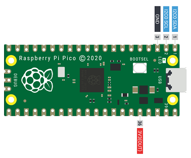

# Raspberry Pi Pico with BME280 Sensor

A small project to demonstrate how to talk to a device on the I2C bus without third party libraries.
This uses microPython on the Pi Pico with a BME280 Sensor.

The BME280 is an environmental sensor capable of measuring temperature, pressure and humidity

## Setup

Attach the sensor to the Pi Pico as shown below

Pi Pico | Pin | BME280
------ | ------- | -------
GP0 | 1 | SDA
GP1 | 2 | SCL
GND | 3 | GND
3V3(OUT) | 4 | 2-6V



## Code

The [code](main.py) is in a style to aid understanding rather than being production ready. For example:

* The calculations are presented as close to the examples in the datasheet as possible
* Constant values are re-read on each run instead of being stored
* No checks for sensor existence or readiness are included
* Lots of output !

## Example Output

```
i2c devices found at
0x76

Sensor data

0x88: 66 6F B8 69 32 00 B0 92 
0x90: BA D6 D0 0B F1 19 DC FF 
0x98: F9 FF AC 26 0A D8 BD 10 
0xa0: 00 4B 79 00 00 00 00 00 
0xa8: 00 00 00 00 33 00 00 C0 
0xb0: 00 54 00 00 00 00 60 02 
0xb8: 00 01 FF FF 1F 4E 08 00 
0xc0: 00 40 6F FF 00 00 00 00 
0xc8: 03 00 00 00 00 00 00 00 
0xd0: 60 00 00 00 00 00 00 00 
0xd8: 00 00 00 00 00 00 00 00 
0xe0: 00 74 01 00 12 28 03 1E 
0xe8: 00 41 FF FF FF FF FF FF 
0xf0: FF 00 03 0C 6F 00 00 55 
0xf8: EE 40 82 2F 80 6A E1 80 

Temperature is 24.43 degrees
Pressure is 980.704 mbar
Humidity is 47.62598 %
```
## Useful Links

The [BME280](https://shop.pimoroni.com/products/bme280-breakout) sensor used

Bosch [datasheet](https://www.bosch-sensortec.com/media/boschsensortec/downloads/datasheets/bst-bme280-ds002.pdf) for the sensor

## Coffee

If you find this project useful, you may want to [__Buy me a Coffee!__ :coffee:](https://www.buymeacoffee.com/codesqueak) Thanks :thumbsup:
